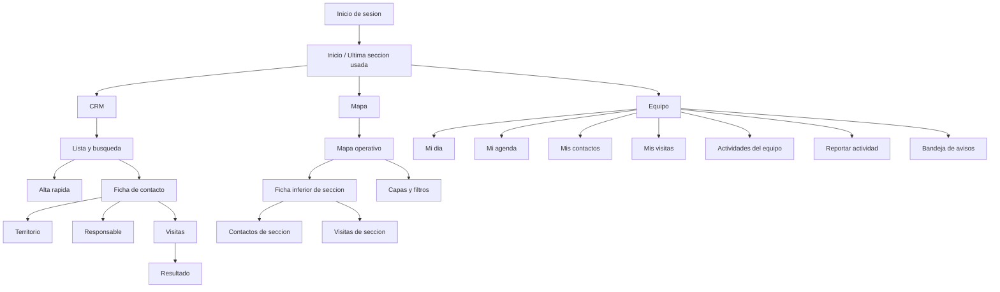

> [!WARNING]
> **DOCUMENTO DEPRECADO (HIST�RICO)**
> Este documento refleja la planeaci�n de la etapa inicial de prototipado. Para ver el estado actual y real del proyecto, consulta [`ROADMAP_V1.md`](./ROADMAP_V1.md).

# PRODUCT_OPERABILITY_PLAN_MOBILE_FIRST

> **Archivado.** Este documento ya no define la direccion de producto.
>
> **Documento activo:** [`PRODUCT_OPERABILITY_PLAN_V1.md`](./PRODUCT_OPERABILITY_PLAN_V1.md)  
> **ADR:** [`ADR-012-v1-usable-web-first.md`](./adr/ADR-012-v1-usable-web-first.md)
>
> Cambio de estrategia: **web-first** con compatibilidad movil (responsive), no mobile-first como objetivo principal. El Walking Skeleton queda completado; el objetivo actual es **V1 utilizable** (`v1.0.0-usable`).
>
> Este archivo se conserva como referencia de detalle UX movil, wireframes y pipeline cartografia INE.

Status: Archived (superseded by V1 plan)  
Scope: Tonala OS operable MVP, mobile-first (historical)  
Date: 2026-07-30

## 1. Resumen Ejecutivo

Tonala OS debe pasar de una base tecnica correcta a una aplicacion operable en campo para Edgar y el equipo. La prioridad inmediata cambia de infraestructura interna a uso diario.

La primera version visible se concentra en tres areas principales:

1. CRM: registrar, buscar, asignar y dar seguimiento a contactos.
2. Mapa: entender el territorio con cartografia oficial y presencia operativa.
3. Equipo: organizar el dia de cada integrante y cerrar actividades pendientes.

La navegacion principal movil tendra solo tres entradas: `CRM`, `Mapa` y `Equipo`. Dashboard, configuracion, auditoria y biblioteca quedan como navegacion secundaria por permisos.

La filosofia del MVP operable es: menos pantallas, menos campos por paso, acciones rapidas, carga clara y utilidad inmediata en telefono celular.

## 2. Usuarios y Roles Principales

Roles ya definidos:

- Administrador: configura usuarios, permisos, catalogos importados y revisa operaciones sensibles.
- Direccion: consulta avance, presencia operativa y estado general sin capturar datos operativos.
- Coordinador territorial: asigna responsables, revisa zonas, programa trabajo y supervisa resultados.
- Capturista: registra contactos y corrige informacion basica permitida.
- Responsable de visita: consulta su agenda, atiende visitas y registra resultados.

Usuarios practicos del MVP:

- Edgar / Direccion: necesita saber si el equipo esta avanzando y donde se esta trabajando.
- Coordinador: necesita convertir contactos en visitas asignadas.
- Capturista: necesita registrar rapido sin abrir formularios pesados.
- Responsable: necesita saber a quien visitar hoy y cerrar evidencia minima.

## 3. Objetivos Diarios de Cada Usuario

Administrador:

- Mantener usuarios activos y con rol correcto.
- Revisar accesos y acciones sensibles.
- Evitar exportaciones o datos fuera de control.

Direccion:

- Ver actividad reciente.
- Detectar zonas sin movimiento.
- Revisar visitas completadas y pendientes.

Coordinador territorial:

- Revisar contactos nuevos.
- Resolver territorio pendiente cuando sea posible.
- Asignar responsables.
- Programar visitas.
- Revisar pendientes vencidos.

Capturista:

- Dar de alta contactos con el menor numero de pasos.
- Buscar contactos existentes antes de duplicar.
- Completar colonia y seccion cuando este disponible.

Responsable de visita:

- Abrir "Mi dia".
- Ver visitas de hoy.
- Llamar o preparar visita cuando haya datos disponibles.
- Registrar resultado y siguiente paso.

## 4. Navegacion Principal

### Navegacion Movil Principal

Barra inferior fija:

- CRM
- Mapa
- Equipo

Cada seccion conserva un encabezado compacto con:

- titulo corto;
- busqueda o filtro contextual;
- accion principal contextual;
- menu secundario por permisos.

Navegacion secundaria:

- Dashboard: visible para Direccion, Administrador y Coordinador.
- Configuracion: visible para Administrador.
- Auditoria: visible para Administrador.
- Biblioteca: futura, fuera del MVP operable inicial.

### Mapa de Navegacion Movil



## 5. Arquitectura de Informacion

### CRM

Informacion principal:

- contacto;
- territorio principal;
- responsable asignado;
- visitas;
- resultados;
- seguimientos;
- estado operativo.

Informacion secundaria:

- observaciones;
- fuente;
- historial de cambios;
- consentimientos futuros;
- relaciones futuras.

### Mapa

Informacion principal:

- geometria oficial de secciones;
- colonias o localidades relacionadas;
- contactos por territorio;
- responsables;
- visitas programadas;
- visitas completadas;
- presencia operativa.

Separacion obligatoria:

- geometria oficial: versionada, sin datos personales.
- informacion operativa: contactos, visitas y asignaciones.
- indicadores derivados: presencia operativa por seccion o colonia.

### Equipo

Informacion principal:

- tareas del dia;
- visitas de hoy;
- contactos asignados recientes;
- actividades proximas;
- resultados faltantes;
- avisos internos.

Informacion secundaria:

- comentarios en actividades;
- historial de estados;
- evidencias opcionales;
- notificaciones internas.

## 6. Flujo CRM Movil

### Flujo Principal

Inicio -> CRM -> buscar contacto -> abrir ficha -> asignar territorio -> asignar responsable -> programar visita -> completar visita.

Reglas UX:

- Antes de crear, buscar.
- Alta rapida en pasos breves.
- No mostrar todos los campos de una vez.
- Cada pantalla debe tener una accion principal clara.
- El sistema debe mostrar si falta territorio, responsable o visita.

### Alta Rapida de Contacto

Paso 1: Nombre

- Campo requerido: nombre visible.
- Accion: continuar.
- Validacion: no vacio, longitud razonable.

Paso 2: Territorio

- Campo requerido cuando sea posible: colonia.
- Campo opcional: seccion.
- Estado permitido: colonia identificada, seccion pendiente.
- Accion: continuar o marcar territorio pendiente.

Paso 3: Responsable

- Selector de responsable.
- Solo Administrador y Coordinador pueden asignar responsables.
- Capturista puede dejar pendiente si no tiene permiso.

Paso 4: Confirmacion

- Resumen: nombre, colonia, seccion si existe, responsable si existe.
- Accion: guardar.
- Resultado: ficha creada y lista para programar visita.

### Pantallas Minimas CRM

Lista de contactos:

- Objetivo: encontrar rapido contactos y detectar pendientes.
- Visible: nombre, colonia, estado territorial, responsable, siguiente accion.
- Acciones: buscar, filtrar, alta rapida, abrir ficha.
- Movil: lista tipo tarjetas compactas, no tabla.

Busqueda:

- Objetivo: evitar duplicados.
- Visible: resultados por nombre, colonia y responsable.
- Acciones: limpiar, filtrar, abrir, crear si no existe.
- Empty state: "No encontramos coincidencias. Puedes crear un contacto nuevo."

Alta rapida:

- Objetivo: capturar en menos de un minuto.
- Visible: un paso a la vez.
- Acciones: continuar, atras, guardar.
- Error: mostrar validacion cerca del campo.

Detalle:

- Objetivo: ficha operativa.
- Visible: nombre, territorio, responsable, visitas, estado de seguimiento.
- Acciones rapidas: programar visita, asignar, ver en mapa, registrar resultado.
- Futuro: llamar si existe telefono.

Territorio:

- Objetivo: resolver colonia y seccion.
- Visible: colonia, seccion, estado de validacion.
- Acciones: cambiar colonia, asignar seccion, marcar pendiente.
- Estados: completo, colonia identificada, sin validar, resuelto automaticamente, validado manualmente.

Responsable:

- Objetivo: asignar o cambiar responsable.
- Visible: responsable actual, fecha de asignacion, quien asigno.
- Acciones: asignar, cambiar, dejar pendiente.
- Permisos: solo Administrador y Coordinador asignan.

Visitas:

- Objetivo: ver agenda del contacto.
- Visible: visitas programadas, completadas y pendientes de resultado.
- Acciones: programar, reprogramar futuro, abrir resultado.

Resultado:

- Objetivo: cerrar una visita con evidencia minima.
- Visible: resultado estructurado, resumen, siguiente paso si aplica.
- Acciones: guardar resultado, crear seguimiento.
- Requerido: resultado estructurado y resumen.

## 7. Flujo Mapa Digital

### Objetivo

Permitir que el equipo entienda exclusivamente el territorio de Tonala, Jalisco desde el telefono, con cartografia oficial importada y sin depender del sitio remoto del INE durante la operacion diaria.

Alcance geografico obligatorio del MVP:

- Entidad: Jalisco.
- Municipio: Tonala.
- No importar otros municipios.
- No importar otras entidades.
- No mostrar datos ni geometria perteneciente a otros municipios.

### Flujo Principal

Inicio -> Mapa -> ver secciones -> activar capas -> tocar seccion -> ver ficha inferior -> abrir contactos o visitas relacionadas.

### Comportamiento Inicial

Al abrir el mapa:

- centrar automaticamente en Tonala, Jalisco;
- ajustar el zoom a los limites municipales de Tonala;
- impedir que la experiencia principal se desplace hacia otros municipios;
- cargar inicialmente las secciones electorales de Tonala;
- mostrar una leyenda clara con fuente, fecha y version cartografica;
- mantener el sitio del INE fuera del runtime operativo.

### Capas Iniciales

- Limite municipal de Tonala.
- Secciones electorales de Tonala.
- Colonias, si la fuente importada lo permite o mediante catalogo complementario validado.
- Contactos georreferenciados.
- Responsables.
- Visitas programadas.
- Visitas completadas.
- Presencia operativa.

Reglas:

- No activar demasiadas capas por defecto.
- La capa base debe ser secciones electorales de Tonala.
- Contactos y visitas deben mostrarse agregados cuando el zoom sea bajo.
- No guardar datos personales en geometria.
- No mostrar datos operativos fuera de Tonala.

### Ficha Inferior de Seccion

Al tocar una seccion:

- numero de seccion;
- municipio: Tonala;
- colonia o localidades relacionadas;
- contactos registrados;
- responsables asignados;
- visitas programadas;
- visitas completadas;
- actividad reciente;
- estado de presencia operativa.

Acciones:

- ver contactos;
- ver visitas;
- crear contacto en esta zona;
- copiar numero de seccion;
- activar capas relacionadas.

### Semaforo de Presencia Operativa

Representa presencia y cobertura operativa.

No representa:

- prediccion electoral;
- intencion de voto;
- afinidad individual;
- probabilidad de persuasion.

Variables iniciales:

- contactos validados;
- responsables asignados;
- visitas realizadas;
- seguimientos pendientes;
- actividad reciente;
- cobertura territorial.

Lectura sugerida:

- Verde: presencia operativa consistente.
- Amarillo: presencia parcial o actividad insuficiente.
- Rojo: sin presencia operativa verificable.
- Gris: sin datos suficientes.

## 8. Estrategia Tecnica Para Cartografia Oficial Del INE

Fuente oficial inicial:

- Mapas Digitales INE: https://cartografia.ine.mx/sige8/mapas/mapas-digitales
- Base Geografica Digital INE: https://cartografia.ine.mx/sige8/productosCartograficos/bases
- Productos cartograficos INE: https://cartografia.ine.mx/sige8/

Alcance de importacion:

- Entidad: Jalisco.
- Municipio: Tonala.
- Capas oficiales requeridas: limite municipal y secciones electorales.
- Colonias o localidades solo si la fuente oficial o un catalogo complementario validado lo permite.
- Cualquier geometria fuera de Tonala debe descartarse antes de publicar el paquete operativo.

Verificacion realizada:

- El portal oficial de Cartografia Electoral del INE publica productos cartograficos y una Base Geografica Digital.
- La pagina publica no debe tratarse como API garantizada sin una revision tecnica especifica.
- No se debe depender del sitio remoto del INE durante la operacion diaria.

Estrategia de importacion:

1. Descarga controlada:
   - obtener el paquete oficial correspondiente a Jalisco desde el portal del INE;
   - guardar el archivo original sin modificar en almacenamiento interno;
   - registrar URL fuente, fecha de descarga, responsable y checksum.

2. Validacion:
   - verificar que el paquete contiene niveles requeridos: entidad, municipio y seccion;
   - confirmar sistema de coordenadas;
   - validar que Tonala corresponde al municipio esperado en Jalisco;
   - identificar claves oficiales de entidad y municipio;
   - validar que no se publicaran secciones de otros municipios;
   - registrar version y fuente.

3. Transformacion:
   - convertir geometria oficial a GeoJSON o PMTiles/MBTiles segun rendimiento;
   - filtrar entidad Jalisco;
   - filtrar municipio Tonala;
   - conservar solo limite municipal y secciones pertenecientes a Tonala;
   - simplificar geometria para movil sin destruir topologia;
   - conservar identificadores oficiales.

4. Almacenamiento:
   - guardar geometria oficial separada de contactos, visitas, responsables, actividades e indicadores operativos;
   - versionar cada importacion cartografica;
   - permitir que una version futura de Tonala reemplace la cartografia anterior sin eliminar ni alterar datos operativos.

5. Publicacion interna:
   - exponer tiles o GeoJSON optimizado a MapLibre;
   - cachear en cliente cuando sea posible;
   - centrar el viewport en los limites municipales de Tonala;
   - restringir la experiencia principal al municipio;
   - no consultar el sitio INE en runtime.

Metadatos obligatorios por importacion:

- fuente;
- URL de descarga;
- entidad: Jalisco;
- municipio: Tonala;
- fecha de descarga;
- fecha de importacion;
- version cartografica;
- checksum;
- sistema de coordenadas;
- capas incluidas;
- responsable de la importacion.

Separacion de datos:

- `cartography_sources`: fuente y version.
- `cartography_geometries`: geometria y claves oficiales.
- tablas operativas existentes: contactos, territorio, asignaciones, visitas, actividades.
- tablas derivadas futuras: presencia operativa por seccion.

Regla de reemplazo futuro:

- una nueva version cartografica de Tonala se importa como version nueva;
- los contactos, visitas, responsables y actividades conservan sus identificadores operativos;
- la relacion operativa con secciones se recalcula o se valida contra la nueva version;
- la version anterior queda archivada para auditoria o rollback tecnico;
- ninguna actualizacion cartografica elimina datos operativos.

Decision tecnica inicial:

- Usar MapLibre como motor visual.
- Probar rendimiento con GeoJSON filtrado de Tonala.
- Si GeoJSON pesa demasiado en movil, pasar a PMTiles/MBTiles.
- No usar iframe del INE.
- No hacer scraping fragil de la interfaz.

## 9. Flujo App Interna

### Pantalla Principal: Mi Dia

Objetivo:

- Que cada integrante sepa que hacer hoy.

Debe mostrar:

- visitas de hoy;
- contactos asignados recientes;
- acciones pendientes;
- actividades proximas;
- evidencias o resultados faltantes;
- alertas operativas;
- accesos rapidos.

### Flujo Principal

Inicio -> Equipo -> Mi dia -> abrir visita/contacto/actividad -> completar accion -> registrar resultado o comentario.

### Pantallas Minimas

Mi dia:

- visitas de hoy;
- pendientes vencidos;
- avisos importantes;
- accesos rapidos.

Mi agenda:

- calendario simple por dia;
- visitas y actividades asignadas.

Mis contactos:

- contactos asignados al usuario;
- filtros por estado: pendiente, con visita, seguimiento.

Mis visitas:

- visitas programadas y completadas;
- accion directa para registrar resultado.

Actividades del equipo:

- lista de actividades operativas;
- responsable;
- estado;
- comentarios.

Reportar actividad:

- tipo de actividad;
- resumen;
- fecha;
- evidencia opcional;
- comentario.

Bandeja de avisos:

- avisos internos;
- cambios de asignacion;
- recordatorios;
- notificaciones dentro de la aplicacion.

No se construye chat en tiempo real. La comunicacion inicial se resuelve con avisos internos, comentarios ligados a actividades, asignaciones, cambios de estado y notificaciones dentro de la app.

## 10. Wireframes Textuales

### Login

```
[Logo Tonala OS]
Correo
Password
[Entrar]
Mensaje de error si credenciales fallan
```

### CRM / Lista

```
Header: CRM                  [+]
[Buscar contacto]
[Filtros: Todos | Pendientes | Asignados | Visita]

Contacto Card
Nombre
Colonia / Seccion pendiente
Responsable
Siguiente accion
[Abrir]

Bottom nav: CRM | Mapa | Equipo
```

### CRM / Alta Rapida

```
Header: Nuevo contacto       Paso 1 de 4
Nombre
[Continuar]

Paso 2:
Colonia
Seccion opcional
[Continuar]

Paso 3:
Responsable
[Continuar]

Paso 4:
Resumen
[Guardar contacto]
```

### CRM / Detalle

```
Header: Contacto
Nombre
Estado: Territorio pendiente / Completo

[Programar visita]
[Asignar responsable]
[Ver en mapa]

Territorio
Responsable
Visitas
Seguimientos
Historial breve
```

### Mapa

```
Header: Mapa                 [Capas]
[Busqueda por seccion o colonia]

Mapa MapLibre
Capas visibles:
- Secciones
- Presencia operativa

Bottom sheet al tocar seccion:
Seccion 1234
Colonias relacionadas
Contactos registrados
Asignados
Visitas programadas
Visitas completadas
Actividad reciente
[Ver contactos] [Ver visitas]
```

### Equipo / Mi Dia

```
Header: Mi dia
Hoy, fecha

Visitas de hoy
- Hora / Contacto / Colonia / Estado

Pendientes
- Resultado faltante
- Seguimiento vencido

Avisos
- Nueva asignacion

[Reportar actividad]
Bottom nav: CRM | Mapa | Equipo
```

### Equipo / Reportar Actividad

```
Header: Reportar actividad
Tipo
Resumen
Fecha
Evidencia opcional
[Guardar]
```

## 11. Design System

Principios:

- Mobile-first.
- Legibilidad antes que decoracion.
- Controles tactiles de minimo 44px.
- Formularios cortos.
- Navegacion inferior clara.
- Encabezado compacto.
- Un boton principal contextual por pantalla.

Tipografia:

- Sans-serif legible.
- Titulos compactos.
- Texto de apoyo breve.
- Sin escalamiento agresivo por viewport.

Color:

- Paleta sobria con 1 color primario, 1 color de acento y estados semanticos.
- Verde, amarillo, rojo y gris solo para semaforo operativo.
- Evitar exceso de colores simultaneos en mapa.

Componentes tactiles:

- botones de 44px o mas;
- inputs con etiquetas claras;
- filtros tipo chips compactos;
- bottom sheets para detalles en mapa;
- cards compactas para listas;
- skeleton loaders;
- banners de error no invasivos;
- confirmaciones antes de acciones destructivas.

## 12. Componentes Reutilizables

- AppShellMobile: header compacto + bottom navigation.
- BottomNav: CRM, Mapa, Equipo.
- ContextActionButton: accion principal segun pantalla.
- SearchBar.
- FilterChips.
- ContactCard.
- VisitCard.
- AssignmentBadge.
- TerritoryStatusBadge.
- EmptyState.
- ErrorBanner.
- SkeletonList.
- StepperForm.
- BottomSheet.
- LayerToggle.
- SectionSummarySheet.
- PermissionGate.
- AuditReasonModal para acciones sensibles futuras.

## 13. Estados de Carga, Error y Vacio

Carga:

- skeleton en listas;
- spinner pequeno solo en acciones puntuales;
- mapa con estado "Cargando cartografia".

Error:

- mensaje claro;
- accion de reintentar;
- no mostrar errores tecnicos crudos;
- registrar error tecnico en observabilidad.

Vacio:

- CRM sin contactos: "Aun no hay contactos. Crea el primero."
- Busqueda sin resultados: "No encontramos coincidencias."
- Mapa sin datos operativos: "Hay cartografia, pero aun no hay actividad registrada."
- Mi dia sin tareas: "No tienes visitas ni pendientes para hoy."

Offline o mala conexion:

- MVP puede mostrar errores claros.
- Offline-ready completo queda fuera de la primera version operable, aunque la UX debe anticiparlo.

## 14. Accesibilidad

Criterios:

- controles tactiles minimo 44px;
- contraste AA para texto principal;
- etiquetas visibles en inputs;
- estados no diferenciados solo por color;
- focus visible;
- soporte de lector de pantalla en botones y navegacion;
- lenguaje simple;
- errores junto al campo;
- mapa con alternativa textual: lista de secciones/contactos filtrados.

## 15. Modelo de Permisos en Interfaz

Regla:

- La UI no reemplaza la autorizacion backend. Solo oculta o deshabilita acciones segun permisos.

Administrador:

- ve CRM, Mapa, Equipo, Configuracion, Auditoria.
- puede asignar responsables.
- puede administrar usuarios.

Direccion:

- ve CRM de consulta segun permiso, Mapa y Equipo/actividad.
- ve resumen operativo.
- no captura cambios operativos salvo permisos especificos.

Coordinador territorial:

- ve CRM, Mapa y Equipo.
- puede asignar responsables.
- puede programar visitas.
- puede revisar pendientes.

Capturista:

- ve CRM.
- puede crear contacto y capturar territorio basico.
- no asigna responsable salvo permiso futuro.

Responsable de visita:

- ve Equipo, sus contactos y sus visitas.
- puede completar visitas asignadas.
- consulta mapa operativo si tiene permiso.

## 16. Contratos Backend Existentes Que Se Reutilizan

Existentes y reutilizables:

- `RegisterMinimalContact`
- `LinkContactToColony`
- `AssignResponsible`
- `ScheduleVisit`
- `CompleteVisit`
- `ActorContext`
- `PermissionChecker`
- RBAC existente
- PostgreSQL + Drizzle
- Transactional Outbox
- Projection Engine existente, detenido temporalmente para expansion

Infraestructura reutilizable:

- migraciones 0001 a 0008;
- repositorios existentes de Contacts, Territory, Assignments, Visits;
- delivery adapters ya existentes donde apliquen;
- boundary checker;
- observabilidad existente.

## 17. Funcionalidades Backend Que Faltan

CRM:

- busqueda movil eficiente de contactos;
- endpoint/read model para lista resumida de contactos;
- endpoint de ficha agregada de contacto;
- endpoint para visitas por contacto;
- endpoint para "mis contactos".

Mapa:

- importador reproducible de cartografia oficial;
- almacenamiento versionado de geometria;
- servicio de tiles o GeoJSON optimizado;
- proyeccion de presencia operativa por seccion;
- endpoint de ficha de seccion.

Equipo:

- modelo de actividades internas;
- avisos internos;
- comentarios ligados a actividades;
- notificaciones in-app simples;
- endpoint "Mi dia";
- endpoint "Mi agenda".

Seguridad:

- permisos finos para ver mapa, asignar, completar visita y administrar equipo.

## 18. Nuevas Migraciones Que Podrian Necesitarse

No crear todavia.

Posibles migraciones futuras:

- cartography_sources;
- cartography_geometries;
- territory_section_colony_links;
- operational_presence_projection;
- team_activities;
- activity_comments;
- internal_notifications;
- user_notification_reads;
- contact_search_projection o indice de busqueda;
- contact_summary_projection;
- section_summary_projection.

Estas migraciones deben aprobarse por incremento, no todas juntas.

## 19. Plan de Implementacion Por Incrementos

Incremento UX-0: Preparacion de interfaz operable

- AppShell mobile-first.
- Login y navegacion inferior.
- Permisos visibles.
- Sin mapa funcional avanzado.

Incremento CRM-1: CRM movil basico

- lista de contactos;
- busqueda;
- alta rapida en pasos;
- ficha de contacto;
- integrar casos de uso existentes.

Incremento CRM-2: Flujo operativo completo

- asignar territorio;
- asignar responsable;
- programar visita;
- completar visita.

Incremento MAP-1: Cartografia oficial importada

- proceso reproducible de descarga/importacion;
- guardar metadata y checksum;
- mostrar secciones de Tonala en MapLibre.

Incremento MAP-2: Capas operativas

- contactos agregados;
- visitas programadas/completadas;
- ficha inferior de seccion;
- presencia operativa basica.

Incremento TEAM-1: Mi dia

- visitas de hoy;
- contactos asignados recientes;
- pendientes;
- accesos rapidos.

Incremento TEAM-2: Actividades y avisos

- actividades del equipo;
- reportar actividad;
- comentarios;
- bandeja de avisos.

## 20. Pruebas de Usabilidad

Pruebas con equipo real:

- crear contacto en menos de 60 segundos;
- buscar contacto existente en menos de 15 segundos;
- programar visita en menos de 45 segundos;
- completar resultado en menos de 45 segundos;
- encontrar visita de hoy sin capacitacion tecnica;
- tocar seccion y entender ficha inferior;
- distinguir presencia operativa sin pensar que es prediccion electoral.

Dispositivos:

- Android gama media;
- iPhone actual;
- pantalla pequena;
- conexion movil irregular simulada.

Metricas:

- tiempo por tarea;
- errores por tarea;
- campos abandonados;
- taps necesarios;
- claridad percibida por usuario.

## 21. Criterios de Terminado de la Primera Version Operable

Funcionalidad:

- usuario inicia sesion;
- navegacion movil muestra CRM, Mapa y Equipo;
- se crea contacto por pasos;
- se busca y abre ficha;
- se asigna territorio;
- se asigna responsable segun permiso;
- se programa visita;
- se completa visita;
- "Mi dia" muestra visitas y pendientes del usuario;
- mapa abre centrado exclusivamente en Tonala;
- mapa ajusta zoom a los limites municipales;
- mapa muestra secciones oficiales importadas de Tonala;
- mapa permite seleccionar una seccion;
- mapa permite activar y desactivar capas;
- mapa relaciona secciones con contactos y visitas;
- mapa muestra fuente, fecha y version cartografica;
- mapa funciona correctamente en telefono celular;
- mapa no consulta en tiempo real el sitio del INE.

Seguridad:

- ninguna accion critica depende solo de ocultar botones;
- permisos backend siguen obligatorios;
- no hay datos personales en geometria;
- no se publican geometria ni datos operativos de otros municipios;
- exportaciones siguen fuera por defecto.

Usabilidad:

- acciones principales visibles en telefono;
- no hay tablas extensas en movil;
- formularios cortos;
- estados vacios utiles;
- errores comprensibles.

Rendimiento:

- listas principales cargan rapido en telefono;
- mapa no bloquea la aplicacion;
- capas operativas no saturan el render inicial.

Calidad de datos:

- territorio puede quedar pendiente sin bloquear alta;
- seccion puede resolverse despues;
- las secciones se relacionan contra la version cartografica activa de Tonala;
- visitas requieren resultado estructurado y resumen.

## 22. Elementos Explicitamente Fuera de Alcance

Fuera del MVP operable inmediato:

- rebuild runner;
- shadow tables;
- cutover;
- Command Center avanzado;
- IA;
- WhatsApp;
- automatizaciones complejas;
- chat en tiempo real;
- rutas optimizadas;
- prediccion electoral;
- KPIs electorales definitivos;
- biblioteca digital completa;
- encuestas masivas;
- portal publico;
- multi-municipio;
- importacion de otros municipios;
- importacion de otras entidades;
- exportaciones operativas.

## Decisiones Que Deben Aprobarse Antes De Implementar

1. Confirmar que la navegacion principal movil queda congelada como `CRM`, `Mapa`, `Equipo`.
2. Confirmar si `Mapa` sera visible para todos los roles o solo Direccion, Coordinador y Administrador en la primera version.
3. Confirmar si Capturista puede asignar responsable o solo dejarlo pendiente.
4. Confirmar si el primer mapa de Tonala debe iniciar con secciones electorales solamente o tambien con colonias si se consigue catalogo validado.
5. Confirmar formato preferido de cartografia para MVP: GeoJSON filtrado primero, con PMTiles/MBTiles solo si rendimiento lo exige.
6. Confirmar si "Mi dia" sera la pantalla inicial despues del login para Responsable de visita.
7. Confirmar si actividades internas requieren evidencia fotografica en MVP o solo texto/resumen.
8. Confirmar nombres finales en interfaz: `Equipo` vs `Mi equipo`, `Mapa` vs `Territorio`.
