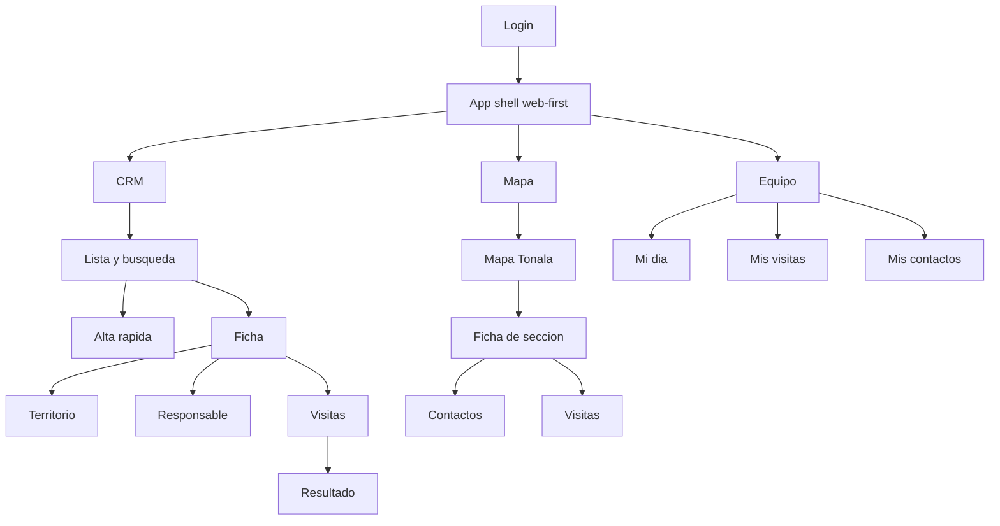

> [!WARNING]
> **DOCUMENTO DEPRECADO (HIST�RICO)**
> Este documento refleja la planeaci�n de la etapa inicial de prototipado. Para ver el estado actual y real del proyecto, consulta [`ROADMAP_V1.md`](./ROADMAP_V1.md).

# PRODUCT_OPERABILITY_PLAN_V1

Status: Active — target product definition  
Scope: Tonala OS **V1 utilizable**, **web-first** con compatibilidad movil  
Supersedes: mobile-first operability draft (see `PRODUCT_OPERABILITY_PLAN_MOBILE_FIRST.md`)  
Date: 2026-08-14  
ADR: `docs/adr/ADR-012-v1-usable-web-first.md`

## 1. Resumen ejecutivo

Tonala OS sale del **Walking Skeleton** (`v0.1.0-walking-skeleton`) y entra en **V1 utilizable** (`v1.0.0-usable`).

El Walking Skeleton demostró que el nucleo tecnico funciona: modulos, Outbox, proyecciones, permisos y PostgreSQL. **V1 es el producto que el equipo usa cada dia en el navegador.**

Principios de V1:

1. **Web-first:** experiencia principal en escritorio y laptop (coordinacion, supervision, captura en oficina).
2. **Responsive:** la misma aplicacion funciona en telefono sin app nativa separada.
3. **Operable:** flujos completos sin herramientas de desarrollador visibles.
4. **Modular monolith:** la UI solo invoca casos de uso; sin SQL en handlers.

Tres areas de producto (igual que antes, distinta prioridad de layout):

| Area | V1 obligatorio | V1 minimo / fase corta |
|------|----------------|----------------------|
| CRM | Alta, busqueda, ficha, territorio, responsable, visitas | Telefono, notas extendidas |
| Mapa | Vista con secciones de Tonala + ficha de seccion | Presencia operativa completa |
| Equipo | Mi dia + mis visitas | Actividades, avisos, agenda calendario |

## 2. Relacion con Walking Skeleton

| Walking Skeleton (completado) | V1 utilizable (ahora) |
|-------------------------------|----------------------|
| Casos de uso: registrar contacto, territorio, asignar, programar/completar visita | Mismos casos de uso + **read models** para listas y fichas |
| Dev server + HTML estatico | **Next.js** App Router |
| Actor por headers de desarrollo | **Login** (Supabase Auth o equivalente) |
| Outbox manual (`run-once` en UI) | **Procesamiento automatico** tras mutaciones |
| `walking_skeleton_projection_v1` (contadores) | Proyecciones/consultas **operativas** para UI |
| Prototipo CRM en 3 tabs | App shell web con CRM / Mapa / Equipo |
| Sin mapa | Mapa Tonala con cartografia importada |
| Sin equipo | Mi dia para responsables |

El Walking Skeleton **no se elimina**; se congela como baseline arquitectonico (ADR-010). V1 construye encima.

## 3. Usuarios y roles

Roles (sin cambio de negocio):

- **Administrador** — usuarios, permisos, catalogos, operaciones sensibles.
- **Direccion** — avance, presencia, estado general (lectura).
- **Coordinador territorial** — asignaciones, zonas, programacion, supervision.
- **Capturista** — registro rapido y correccion basica.
- **Responsable de visita** — agenda del dia, visitas, resultados.

V1 debe respetar permisos en **backend** (ya existe) y **ocultar acciones en UI** segun rol, no solo deshabilitar botones sin validacion server-side.

## 4. Arquitectura de entrega (web-first)

### 4.1 Stack de V1

```txt
apps/web          Next.js App Router (paginas, route handlers, server actions)
packages/ui       Layout, navegacion, componentes compartidos
packages/modules  Casos de uso (sin cambio de regla de dependencias)
packages/shared   Kernel, auth, db, outbox, projections
```

### 4.2 Layout por breakpoint

**Desktop (`>= 1024px`)**

- Barra lateral fija: CRM, Mapa, Equipo.
- Area principal con encabezado contextual (titulo, busqueda, accion primaria).
- CRM: lista + detalle en split view (no tabla extensa sin scroll controlado).
- Mapa: mapa amplio + panel lateral o inferior para ficha de seccion.
- Equipo: columnas o cards segun seccion.

**Tablet (`768px – 1023px`)**

- Sidebar colapsable o iconos.
- Split views donde el espacio permita; otherwise stack.

**Movil (`< 768px`)**

- Navegacion primaria inferior: CRM | Mapa | Equipo (misma semantica, distinto patron de layout).
- Una columna; ficha de contacto en pantalla completa al seleccionar.
- Formularios cortos; acciones principales visibles sin scroll infinito.

### 4.3 Mapa de navegacion



Navegacion secundaria (permisos): Dashboard, Configuracion, Auditoria. Fuera de V1 inicial: Biblioteca.

### Inicio segun rol (decision cerrada)

Tras login, redirigir al usuario a la pantalla mas util para su rol:

| Rol | Pantalla inicial |
|-----|------------------|
| Responsable de visita | Mi dia |
| Coordinador territorial | CRM |
| Capturista | CRM |
| Direccion | Resumen operativo |
| Administrador | CRM o configuracion |

El usuario siempre puede cambiar de seccion con la navegacion principal.

## 5. CRM — alcance V1

### Flujos obligatorios

`Buscar → crear (pasos) → territorio → responsable → programar visita → completar visita`

### Pantallas V1

| Pantalla | Desktop | Movil |
|----------|---------|-------|
| Lista contactos | Tabla compacta o cards en panel izquierdo | Cards + busqueda |
| Alta rapida | Modal o panel paso a paso | Pantalla completa por paso |
| Ficha contacto | Panel derecho persistente | Pantalla completa |
| Visitas del contacto | Lista con accion completar | Lista + formulario resultado |
| Busqueda | Barra superior persistente | Barra bajo header |

### Alta rapida (4 pasos)

1. Nombre (requerido)
2. Territorio — colonia; seccion opcional en V1 si catalogo disponible
3. Responsable — admin/coordinador asignan; **capturista puede dejar pendiente** (estado visual distinto: color/badge **pendiente** vs **asignado**; ver paleta UI en `packages/ui`)
4. Confirmacion y guardar

### Backend CRM para V1 (nuevo)

- `ListContacts` / read model — busqueda, filtros basicos, resumen territorial y visitas
- `GetContactDetail` — agregado: contacto + territorio + asignacion + visitas recientes
- `ListVisitsByContact` — IDs y estado para completar sin UUID manual
- `ListMyVisits` / `ListVisitsForUser` — para Mi dia y mis visitas

Reutilizar sin cambio de contrato publico:

- `RegisterMinimalContact`
- `LinkContactToColony`
- `AssignResponsible`
- `ScheduleVisit`
- `CompleteVisit`

## 6. Mapa — alcance V1

### Objetivo V1

Entender territorio de **Tonala, Jalisco** en el navegador con cartografia importada (no runtime INE).

### V1 obligatorio

- Centrar en limites municipales de Tonala
- Capa base: secciones electorales importadas
- Seleccionar seccion → ficha (numero, colonias si existen, conteos de contactos/visitas)
- Enlace a contactos/visitas de la seccion

### V1 deseable (si tiempo)

- Capas toggle: contactos agregados, visitas programadas/completadas
- Semáforo presencia operativa basico

### Alcance mapa V1 (decision cerrada)

El mapa es **visible y utilizable para todos los usuarios**. En V1 debe ser **funcional, fluido y con la mayor cantidad de informacion posible**:

- Limite municipal y secciones electorales de Tonala (obligatorio)
- Colonias / localidades si el catalogo validado lo permite
- Contactos y visitas en capas operativas
- Presencia operativa por seccion (semáforo basico)
- Ficha de seccion con conteos y enlaces a CRM
- Rendimiento: probar GeoJSON filtrado; adoptar **PMTiles/MBTiles** si el mapa no es fluido en movil

La visibilidad del mapa no implica permisos de escritura: asignar, programar o completar siguen segun rol.

### Fuera de V1 inmediato

- Rutas optimizadas
- Prediccion electoral
- Multi-municipio

Estrategia cartografia: igual que plan anterior (importacion controlada INE → GeoJSON/PMTiles, metadata versionada). Ver seccion cartografia en plan mobile-first archivado para detalle de pipeline.

## 7. Equipo — alcance V1

### V1 obligatorio

- **Mi dia:** visitas de hoy para el actor actual, pendientes de resultado, acceso rapido a completar
- **Mis visitas:** programadas y completadas del usuario
- **Mis contactos:** contactos asignados al usuario

### V1 fase 2 (dentro de v1.0.0-usable si posible)

- Mi agenda (vista calendario simple)
- Actividades del equipo
- Bandeja de avisos internos

### Fuera de V1

- Chat en tiempo real
- Evidencia fotografica obligatoria

## 8. Autenticacion y seguridad V1

| Requisito | V1 |
|-----------|-----|
| Login email/password (Supabase Auth) | Obligatorio |
| Sesion en servidor / cookies seguras | Obligatorio |
| Permisos derivados del rol en servidor | Obligatorio |
| Headers `x-tonala-*` solo en test/local | Obligatorio |
| `/api/setup` en produccion | Deshabilitado |
| RLS Supabase | Deseable; application layer obligatorio |
| Auditoria en mutaciones | Ya existe; mantener |

## 9. Infraestructura y operacion V1

- PostgreSQL (Docker local; managed en staging/prod)
- Outbox worker automatico en el mismo despliegue o job programado
- CI: `validate:unit` + integracion con Postgres en pipeline
- `.env` documentado; sin secretos en cliente

## 10. Plan de implementacion por incrementos

Orden recomendado. **No iniciar mapa completo antes de CRM utilizable.**

### V1-0 — App shell y auth (bloqueante)

- Next.js en `apps/web`
- Login y logout
- Layout web-first responsive (sidebar desktop, bottom nav movil)
- `packages/ui`: shell, botones, inputs, estados vacios
- Route handlers delgados (ADR-003)
- Quitar dependencia de prototipo `public/index.html` para producto

**Terminado cuando:** usuario autenticado navega CRM/Mapa/Equipo; **inicio segun rol** (responsable → Mi dia, coordinador → CRM, direccion → resumen, etc.).

### V1-1 — CRM utilizable

- Read models + APIs: lista, detalle, visitas por contacto
- Alta rapida 4 pasos
- Ficha con territorio, responsable, programar visita
- Completar visita desde lista (sin UUID manual)
- Outbox automatico tras mutaciones
- Seeds: usuarios demo por rol (admin, coordinador, capturista, responsable)

**Terminado cuando:** coordinador completa flujo feliz en desktop sin consola ni botones dev.

### V1-2 — Equipo (campo)

- Mi dia, mis visitas, mis contactos
- Responsable completa visita desde Mi dia en movil

**Terminado cuando:** responsable usa telefono para ver y cerrar visita del dia.

### V1-3 — Mapa Tonala

- Migraciones cartografia (aprobadas por incremento)
- Importador + metadata
- MapLibre en pagina Mapa
- Ficha de seccion + enlaces a CRM

**Terminado cuando:** coordinador ubica seccion y abre contactos relacionados.

### V1-4 — Endurecimiento release

- CI completo
- Pruebas E2E flujo CRM
- Staging deploy
- Remover herramientas dev de UI
- Documentacion operativa para Edgar

## 11. Criterios de terminado V1 (`v1.0.0-usable`)

### Funcionalidad

- [ ] Login funcional para todos los roles demo
- [ ] Navegacion CRM / Mapa / Equipo en desktop y movil
- [ ] Crear contacto por pasos
- [ ] Buscar y abrir ficha
- [ ] Asignar territorio y responsable segun permiso
- [ ] Programar y **completar** visita sin herramientas tecnicas
- [ ] Mi dia muestra visitas del usuario
- [ ] Mapa centrado en Tonala con secciones importadas
- [ ] Outbox sin accion manual del usuario

### Calidad

- [ ] `pnpm validate` pasa en CI
- [ ] Sin SQL de negocio en route handlers (solo casos de uso / read models)
- [ ] Errores en espanol operativo
- [ ] Estados vacios utiles

### Usabilidad (objetivos)

| Tarea | Objetivo |
|-------|----------|
| Crear contacto | < 60 s |
| Buscar contacto | < 15 s |
| Programar visita | < 45 s |
| Completar visita | < 45 s |
| Encontrar visita de hoy | Sin capacitacion tecnica |

Probar en desktop + Android gama media + iPhone.

## 12. Elementos fuera de alcance V1

- Walking Skeleton como meta de producto
- Prototipo HTML `apps/web/public` como entrega
- Command Center ejecutivo avanzado
- IA, WhatsApp, chat real-time
- Exportaciones operativas por defecto
- Multi-municipio / otras entidades
- PWA offline-first
- rebuild runner / shadow projections / cutover

## 13. Decisiones de producto (cerradas)

| # | Decision | Resolucion |
|---|----------|------------|
| 1 | Visibilidad del mapa | **Todos los usuarios** ven y usan el mapa segun su rol (lectura operativa; acciones segun permiso). |
| 2 | Capturista y responsable | Puede **dejar responsable pendiente**; el estado pendiente usa **color/badge distinto** al asignado (identificacion visual clara). |
| 3 | Alcance del mapa en V1 | **Mapa funcional y fluido** con la **mayor cantidad de informacion posible** en V1: secciones, colonias si catalogo validado, contactos, visitas, presencia operativa basica; priorizar rendimiento (PMTiles si hace falta). |
| 4 | Pantalla inicial post-login | **Inicio adaptado al rol** — responsable → Mi dia; coordinador/capturista → CRM; direccion → resumen; admin → segun rol. |
| 5 | Nombres UI | Mantener **CRM**, **Mapa**, **Equipo** en navegacion principal. |
| 6 | Evidencia en actividades | Fuera de V1 inicial; texto/resumen suficiente. |

## 14. Referencias

- `docs/adr/ADR-010-baseline-walking-skeleton.md` — baseline completado
- `docs/adr/ADR-012-v1-usable-web-first.md` — decision V1
- `docs/adr/ADR-003-nextjs-delivery-layer.md` — handlers delgados
- `docs/PRODUCT_OPERABILITY_PLAN_MOBILE_FIRST.md` — archivado; detalle UX movil y cartografia INE
