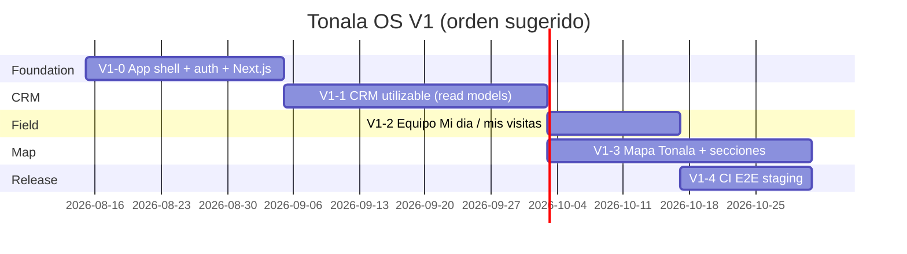

# Roadmap V1 — Tonala OS

Objetivo: **`v1.0.0-usable`** — aplicacion web operable en el dia a dia.

Estrategia: **web-first responsive** (ADR-012). Walking Skeleton completado; no mas incrementos "skeleton".

## Decisiones cerradas (2026-08-14)

- Mapa visible y utilizable para **todos** los usuarios.
- Capturista puede dejar responsable **pendiente** (badge/color distinto).
- Mapa V1: **maxima informacion posible**, fluido (PMTiles si hace falta).
- Inicio post-login: **pantalla segun rol** (mejor experiencia para quien entra).

Las duraciones son orientativas; el orden de bloques es el importante.

## Incrementos

| ID | Nombre | Entregable clave | Depende de |
|----|--------|------------------|------------|
| V1-0 | App shell + auth | Next.js, login, layout desktop/movil | — |
| V1-1 | CRM utilizable | Lista, ficha, visitas listables, completar sin UUID, outbox auto | V1-0 |
| V1-2 | Equipo campo | Mi dia, mis visitas, mis contactos | V1-1 |
| V1-3 | Mapa Tonala | Cartografia importada, MapLibre, ficha seccion | V1-1 |
| V1-4 | Release | CI, E2E, staging, sin UI dev | V1-1, V1-2, V1-3 |

**Regla:** no bloquear V1 en mapa completo antes de CRM diario usable.

## Que reutiliza del Walking Skeleton

- Modulos Contacts, Territory, Assignments, Visits
- Outbox + Projection Engine
- Migraciones 0001–0008
- `walking_skeleton_projection_v1` (contadores tecnicos; no sustituye read models de UI)

## Que cambia respecto al skeleton

| Antes (skeleton) | V1 |
|------------------|-----|
| Dev server + HTML estatico | Next.js App Router |
| Headers `x-tonala-*` en UI | Login + sesion |
| SQL en dev-server para listas | Casos de uso / read models |
| Boton "Procesar outbox" | Worker automatico |
| Prototipo 3 tabs | Shell CRM / Mapa / Equipo |
| Mobile-first (doc) | Web-first responsive |

## Checklist release `v1.0.0-usable`

Ver seccion 11 en [`PRODUCT_OPERABILITY_PLAN_V1.md`](./PRODUCT_OPERABILITY_PLAN_V1.md).

## Documentos relacionados

- [PRODUCT_OPERABILITY_PLAN_V1.md](./PRODUCT_OPERABILITY_PLAN_V1.md)
- [ADR-012-v1-usable-web-first.md](./adr/ADR-012-v1-usable-web-first.md)
- [ADR-010-baseline-walking-skeleton.md](./adr/ADR-010-baseline-walking-skeleton.md) (baseline congelado)
- [ADR-003-nextjs-delivery-layer.md](./adr/ADR-003-nextjs-delivery-layer.md)
