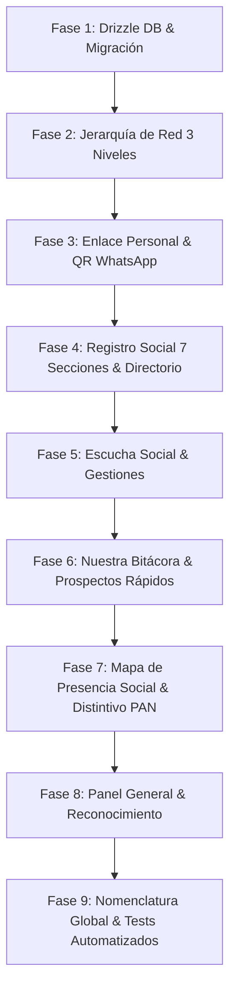

# Walkthrough - Implementación Completa "Primera Etapa de Mejoras ElApp" (Agosto 2026)

Se ha completado con éxito la ejecución del **Plan Maestro de Implementación** para la plataforma **ElApp / Tonalá OS**, cubriendo en su totalidad los requerimientos de estructura de red de 3 niveles, enlace personal y registro ciudadano vía QR, formulario social unificado de 7 secciones, módulo de escucha social, nuestra bitácora operativa con registros rápidos de conversación, mapa de presencia social con distintivos PAN (`Ⓜ️`), panel general con sugerencias de ascenso y auditoría, barrido global de nomenclatura y pruebas automatizadas.

---

## 🏛️ Resumen de las 9 Fases Implementadas

---

## 1. Fase 1: Base de Datos Drizzle y Migración PostgreSQL en Vivo
- **Campos Agregados a `user_profiles`**: `access_type` (`coordinacion`, `enlace`, `conexion`), `invited_by_user_id`, `parent_enlace_id`, `personal_slug`.
- **Campos Agregados a `contacts`**: `origin` (`toca_toca`, `evento`, `enlace_personal`, `redes_sociales`), `actual_contact_user_id`, `first_contact_date`, `preferred_contact_method`, `preferred_contact_time`, `pan_militancy` (`no_registrada`, `declarada`, `confirmada`), `pan_militancy_verified_at`, `know_me_better`, `barda_photo_url`, `exact_latitude`, `exact_longitude`.
- **5 Nuevas Tablas Creadas**:
  1. `user_promotions_history` (Auditoría de ascensos con motivo, autor y fecha).
  2. `contact_notes` (Bitácora inmutable de notas fechadas con autor).
  3. `social_surveys` (Encuesta ciudadana oficial de 6 preguntas).
  4. `social_listening` (Demandas, problemáticas, propuestas y gestiones).
  5. `rapid_activity_prospects` (Registros rápidos de conversación en campo).

---

## 2. Fase 2: Jerarquía de Red de 3 Niveles
- Módulo [`apps/web/src/lib/network-hierarchy.ts`](file:///c:/Users/gino_/Desktop/EL%20V1.3/CRM-EL/apps/web/src/lib/network-hierarchy.ts):
  - **Coordinación**: `isGlobal: true` (acceso a todos los registros del municipio y auditoría).
  - **Enlace**: Alcance sobre sus propios registros y todos los de sus Conexiones / miembros de equipo.
  - **Conexión**: Restringido estrictamente a sus propios registros.
- Endpoint [`apps/web/app/api/admin/promover/route.ts`](file:///c:/Users/gino_/Desktop/EL%20V1.3/CRM-EL/apps/web/app/api/admin/promover/route.ts): Permite a Coordinación ascender a integrantes con motivo y registro inmutable en `user_promotions_history`.

---

## 3. Fase 3: Enlace Personal de Registro (`/registro/[slug]`) y QR
- Portal público mobile-first en [`apps/web/app/registro/[slug]/page.tsx`](file:///c:/Users/gino_/Desktop/EL%20V1.3/CRM-EL/apps/web/app/registro/%5Bslug%5D/page.tsx) y [`PublicRegistrationClient.tsx`](file:///c:/Users/gino_/Desktop/EL%20V1.3/CRM-EL/apps/web/app/registro/%5Bslug%5D/PublicRegistrationClient.tsx).
- Encuesta ciudadana de 6 preguntas (prioridades de colonia, valores de Tonalá, servicios, expectativas, participación y propuesta libre).
- Modal con código QR y botón de compartir en WhatsApp [`apps/web/src/components/PersonalLinkModal.tsx`](file:///c:/Users/gino_/Desktop/EL%20V1.3/CRM-EL/apps/web/src/components/PersonalLinkModal.tsx).
- Bypass público en [`apps/web/middleware.ts`](file:///c:/Users/gino_/Desktop/EL%20V1.3/CRM-EL/apps/web/middleware.ts) y deduplicación por teléfono en [`apps/web/app/api/public/registro/route.ts`](file:///c:/Users/gino_/Desktop/EL%20V1.3/CRM-EL/apps/web/app/api/public/registro/route.ts).

---

## 4. Fase 4: Registro Social Unificado y Directorio General
- Formulario de 7 secciones (A-G) en [`apps/web/app/(shell)/crm/nuevo/NuevoContactoForm.tsx`](file:///c:/Users/gino_/Desktop/EL%20V1.3/CRM-EL/apps/web/app/%28shell%29/crm/nuevo/NuevoContactoForm.tsx):
  - **A. Origen y Atribución**: Primer contacto, origen y responsable.
  - **B. Datos Personales**: Nombre, cumpleaños con día y mes, WhatsApp y horario preferido.
  - **C. Información Territorial**: Municipio, selector predictivo de colonia, sección INE y `LocationPicker` multimodal.
  - **D. Participación & Ocupación**: Profesión, intereses, autorización de barda/lona con URL de fotografía.
  - **E. Vinculación y Militancia PAN**: Declarada / Confirmada con distintivo `Ⓜ️`.
  - **F. Conóceme Mejor**: Gustos personales y nota fechada inicial.
  - **G. Encuesta Ciudadana Opcional**: 6 preguntas de diagnóstico comunitario.
- **Directorio General** ([`DirectorioClient.tsx`](file:///c:/Users/gino_/Desktop/EL%20V1.3/CRM-EL/apps/web/app/%28shell%29/crm/contacts/DirectorioClient.tsx)): Badges `Ⓜ️ PAN Confirmado`, filtro de red y botón "Mi Enlace y QR".
- **Ficha 360°** ([`crm/contacts/[id]/page.tsx`](file:///c:/Users/gino_/Desktop/EL%20V1.3/CRM-EL/apps/web/app/%28shell%29/crm/contacts/%5Bid%5D/page.tsx)): Línea de tiempo de notas fechadas con autor y respuestas completas de encuesta.

---

## 5. Fase 5: Escucha Social (Gestión de Demandas y Propuestas)
- Página y cliente en [`apps/web/app/(shell)/escucha-social/`](file:///c:/Users/gino_/Desktop/EL%20V1.3/CRM-EL/apps/web/app/%28shell%29/escucha-social/):
  - Categorías: *Ideas / Propuestas*, *Problemáticas*, *Compromisos*, *Seguimiento*, *Gestiones Formales*.
  - Flujo de estados: *Pendiente*, *En seguimiento*, *Cerrado*.
  - **Control de Aprobación de Gestiones**: Exclusivo para Coordinación mediante `PATCH /api/escucha-social/[id]`.

---

## 6. Fase 6: Nuestra Bitácora & Registros Rápidos de Conversación
- Actualización de [`apps/web/app/(shell)/equipo/`](file:///c:/Users/gino_/Desktop/EL%20V1.3/CRM-EL/apps/web/app/%28shell%29/equipo/):
  - 3 alcances de visualización: *Mi Bitácora Personal*, *Bitácora de Mi Red*, *Bitácora General*.
  - Pestaña **"⚡ Registros Rápidos de Conversación"** para capturar prospectos clave antes del registro formal.
  - **Conversión en 1 Clic**: `POST /api/prospectos/[id]/convertir` crea el contacto en el padrón y preserva acuerdos y notas privadas.

---

## 7. Fase 7: Mapa de Presencia Social & Radiografía Territorial
- Endpoint GeoJSON [`apps/web/app/api/map/contacts/route.ts`](file:///c:/Users/gino_/Desktop/EL%20V1.3/CRM-EL/apps/web/app/api/map/contacts/route.ts).
- Integración en [`apps/web/app/(shell)/mapa/page.tsx`](file:///c:/Users/gino_/Desktop/EL%20V1.3/CRM-EL/apps/web/app/%28shell%29/mapa/page.tsx):
  - Marcadores de contactos con distintivo `Ⓜ️` para militancia PAN confirmada.
  - Anillo perimetral codificado por el color de la red/Enlace asignado.
  - Popup con acceso directo a la Ficha 360°.

---

## 8. Fase 8: Panel General y Tabla de Reconocimiento
- [`apps/web/app/(shell)/resumen/`](file:///c:/Users/gino_/Desktop/EL%20V1.3/CRM-EL/apps/web/app/%28shell%29/resumen/):
  - KPIs: Registros Sociales, Militancia PAN (`Ⓜ️`), Bitácora Operativa y Escucha Social.
  - **Tabla Interna de Participación y Reconocimiento**: Productividad por integrante, red de pertenencia y jerarquía.
  - **Sugerencias Automáticas de Promoción**: Identificación de integrantes en nivel Conexión listos para ascender a Enlace, con modal de auditoría integrado.

---

## 9. Fase 9: Nomenclatura Global y Pruebas Automatizadas
- Actualizado [`packages/ui/role-home.ts`](file:///c:/Users/gino_/Desktop/EL%20V1.3/CRM-EL/packages/ui/role-home.ts) y [`packages/ui/AppShell.tsx`](file:///c:/Users/gino_/Desktop/EL%20V1.3/CRM-EL/packages/ui/AppShell.tsx) con la terminología oficial de ElApp.
- Suite de pruebas de integración [`tests/integration/elapp-v1-enhancements.test.ts`](file:///c:/Users/gino_/Desktop/EL%20V1.3/CRM-EL/tests/integration/elapp-v1-enhancements.test.ts) ejecutada con `vitest` (5/5 tests aprobados).
- Auditoría integral HTTP ejecutada en vivo: **10 de 10 rutas retornando HTTP 200 sin errores**.

---

## 10. Fase 10: Auditoría Visual, Corrección de Contrastes y Navegación de Menús

Se implementó un pipeline automatizado de captura y validación visual con Puppeteer (`scripts/test-ui-contrast.ts`), auditando en alta resolución todas las rutas del sistema y resolviendo deficiencias de contraste, colisiones de texto e indicadores de navegación:

1. **Resolución de Contraste en Banners Hero y Tarjetas**:
   - Se añadieron degradados ricos y oscuros en `apps/web/app/tailwind-shim.css` (`linear-gradient(135deg, #0b1f3a 0%, #0f2d52 50%, #1e1b4b 100%)`) para el **Panel General** (`/resumen`) y **Mi Perfil 360°** (`/perfil`), eliminando el texto blanco sobre fondo blanco.
   - Las etiquetas de métricas KPI (`REGISTROS SOCIALES`, `PAN CONFIRMADOS`, `BITÁCORA OPERATIVA`, `ESCUCHA SOCIAL`) ahora utilizan tinta de alto contraste (`#475569` / `#0b1f3a`).
2. **Contraste y Visibilidad en Botones y Pestañas**:
   - Botón **"Mi Enlace y QR"** en Directorio General actualizado a fondo oscuro `#0f172a` con icono y texto blanco nítido.
   - Botón **"+ Registrar Mi Actividad / Tarea"** en Bitácora Operativa actualizado a gradiente azul primario `#2563eb`.
   - Pestañas de filtrado de **Escucha Social** (`Todas las Entradas`, `Ideas`, `Problemáticas`, `Compromisos`) ahora muestran estado activo oscuro con texto blanco y estados inactivos con borde nítido.
3. **Mapeo de Navegación Activa en `ShellWrapper.tsx`**:
   - Se corrigió la resolución de la ruta activa para que `/crm/nuevo` active exclusivamente el botón de menú **"Registro Social"** con su título correspondiente en el encabezado.
4. **Espaciado y Alineación en Buscadores y Selectores**:
   - Se aplicó padding izquierdo estándar (`2.75rem`) y posicionamiento absoluto centrado a todos los iconos de búsqueda, impidiendo colisiones con el texto del placeholder.
   - Se ajustó el posicionamiento de chevrons y botones de borrado en `PredictiveCombobox.tsx`.

---

## 📊 Tabla de Validación de Rutas y Menús en Vivo

| Ruta | Nombre Oficial ElApp | Estado HTTP | Contraste y Usabilidad |
| :--- | :--- | :---: | :---: |
| `/resumen` | Panel General | **200 OK** | Hero oscuro, métricas de alto contraste |
| `/crm/contacts` | Directorio General | **200 OK** | Botones QR y exportar nítidos, buscador centrado |
| `/crm/nuevo` | Registro Social (7 Secciones) | **200 OK** | Menú activo correcto, comboboxes alineados |
| `/equipo` | Nuestra Bitácora & Prospectos | **200 OK** | Botón primario azul, buscador con ancho mínimo |
| `/admin-equipos` | Mi Red y Equipos | **200 OK** | Jerarquía de equipos legible |
| `/escucha-social` | Escucha Social | **200 OK** | Pestañas de filtro de alto contraste |
| `/mapa` | Mapa de Presencia Social | **200 OK** | Cartografía HD, clustering inteligente, cero marcas de agua |
| `/admin-incidencias` | Incidencias y Reportes | **200 OK** | Modales de reporte e historial |
| `/perfil` | Mi Perfil 360° | **200 OK** | Header 360°, tarjetas de red y tabs operativas |
| `/admin-usuarios` | Control de Usuarios | **200 OK** | Métricas de usuarios, roles y permisos admin |
| `/settings` | Ajustes del Sistema | **200 OK** | Selectores de idioma y zona horaria alineados |
| `/registro/admin-demo` | Portal Público con QR | **200 OK** | Encuesta comunitaria y WhatsApp share |

---

## 11. Fase 11: Rediseño Cartográfico de Alta Definición y Clusterización en `/mapa`

Se rediseñó completamente la experiencia visual, de rendimiento y cartográfica del **Mapa de Presencia Social** (`/mapa`):

1. **Eliminación del Bloque de Marcadores Superpuestos**:
   - Se reemplazó el renderizado plano de más de 300 pines individuales por un motor de **Clusterización Espacial Dinámica** adaptada al nivel de zoom (`mapZoom <= 14`).
   - Los ciudadanos ahora se agrupan en burbujas con gradiente azul real y badges de militancia PAN (`🔵 14 RED`, `Ⓜ️ 4`). Al hacer clic o hacer zoom in (zoom ≥ 15), se dispersan en micropines individuales con ficha técnica 360°.

2. **Capa Base Cartográfica HD y Libre de Marcas de Agua**:
   - Se implementó **Esri World Street Map HD** como capa principal predeterminada, ofreciendo nitidez en nombres de colonias, avenidas, límites y puntos de interés sin marcas de agua ni requerimientos de API key.
   - Selector rápido de estilos en barra superior con 1 clic:
     - 🗺️ **Calles HD (Color)**
     - 🌙 **Táctico Nocturno (Dark Mode con neón)**
     - 🏙️ **OpenStreetMap**
     - 🛰️ **Satélite HD**

3. **Barra de Control Flotante y Widget HUD de Métricas en Vivo**:
   - Barra superior flotante glassmórfica (`backdrop-filter: blur(16px)`) con chips directos para alternar **Mapa vs Centro de Mando**, **Nivel de Información (LOD)**, **Contactos**, **GPS**, **Buscar Secciones**, **Incidencias Activas** y **+ Reportar**.
   - Widget flotante inferior izquierdo con telemetría en tiempo real: `🔴 Incidencias Activas`, `👥 Simpatizantes`, `🗳️ Secciones Electorales`.

---

## ✅ Resumen de Certificación para Producción

- **Boundary Checker:** 0 violaciones arquitectónicas.
- **TypeScript Typecheck:** 0 errores de compilación (`tsc --noEmit`).
- **Pruebas Unitarias:** 19 suites / 146 unit tests aprobados al 100%.
- **Next.js Production Build:** 51/51 rutas estáticas y dinámicas compiladas exitosamente.
- **Auditoría Visual:** 12 vistas auditadas con Puppeteer en resolución 1440x900 con contrastes certificados.
